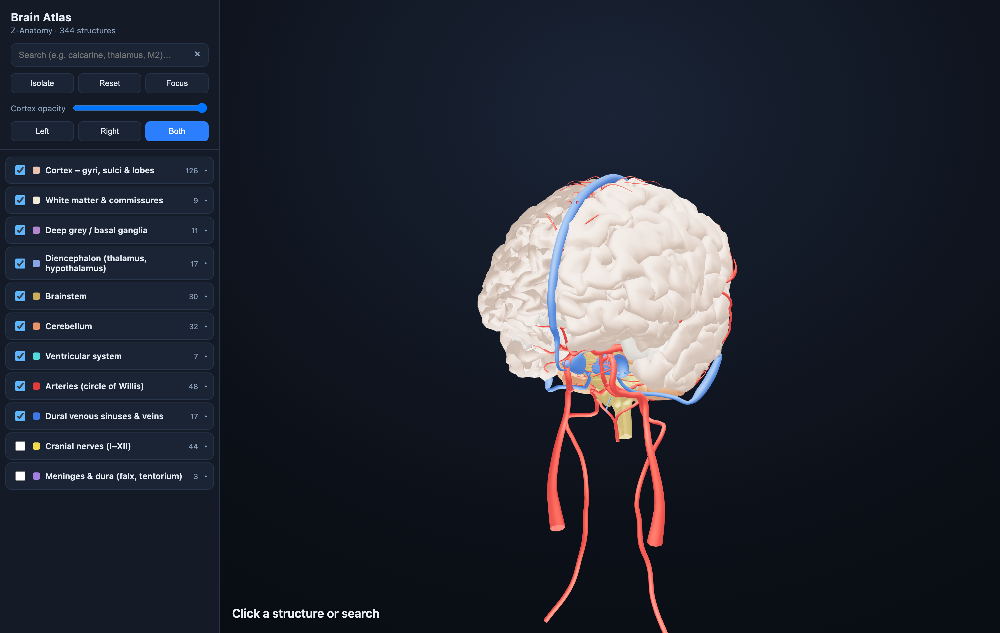

# Brain Atlas — interactive 3D brain (Z‑Anatomy)

An anatomically‑accurate, fully open‑source 3D brain you can spin, search, and dissect
in the browser. **344 individually‑named structures** — every cortical gyrus and sulcus,
the deep grey nuclei, ventricles, brainstem, cerebellum, the dural venous sinuses, the
circle of Willis, the dural reflections, and the cranial nerves — each one a separate,
labelled, toggleable mesh.

The geometry comes from **[Z‑Anatomy](https://www.z-anatomy.com/)**, which is built on
**[BodyParts3D](https://lifesciencedb.jp/bp3d/)** (DBCLS, Japan). Both are released under
**Creative Commons Attribution‑ShareAlike**. Nothing here is fabricated — every mesh is a
real, TA2‑named anatomical structure.



---

## Two front-ends in this repo

| Folder | What it is |
|---|---|
| **`brain-atlas/`** | The **designed prototype** (from Claude Design) implemented for real — a frosted-glass floating control panel, live search, hemisphere toggle, cortex-opacity fader, a build-your-own layer tree, **cinematic presets** (Vasculature, Circle of Willis, Ventricles, Limbic…), a vertical **depth scrubber**, and a **selection card** with the full TA2 breadcrumb, plain-language description and related structures. Wired to the real `brain.glb` with true **per-structure** picking, focus and isolate. |
| **`web/`** | A minimal, dependency-light Three.js viewer (search + layer toggles + hemisphere + isolate). Good as a reference / embed. |

Both read the **same** `brain.glb` + `manifest.json`. To run the designed prototype:

```bash
cd brain-atlas
python3 -m http.server 8861
# open http://localhost:8861/
```

`brain-atlas/` pulls Three.js + React from a CDN and loads the Draco decoder from
`brain-atlas/vendor/draco/`; everything else (model, data, UI) is local.

---

## Quick start (minimal viewer)

No build step. Just serve the `web/` folder over HTTP (ES modules + `fetch` need a
server; opening the file directly won't work) and open it.

```bash
cd web
python3 -m http.server 8847
# then open http://localhost:8847/
```

Any static server works (`npx serve web`, `php -S`, nginx, GitHub Pages, …).
Everything it needs — Three.js, the Draco decoder, the model — is vendored locally under
`web/`, so it runs offline.

---

## Using it

### Navigation
| Action | Control |
|---|---|
| **Rotate** | left‑drag |
| **Pan / drift** | hold **⌘ Cmd** (or **Ctrl**) and left‑drag, or right‑drag |
| **Zoom** | scroll / pinch |
| **Select a structure** | click it in the 3D view |
| **Hover** | structures glow faintly under the cursor |

When you select something, its full name (with side) and its **TA2 anatomical path**
(e.g. `Telencephalon › Frontal lobe › Precentral gyrus`) appear at the bottom‑left.

### Side panel
- **Search** — type any part of a name, region, or system (`calcarine`, `thalamus`,
  `M2`, `sinus`, `vagus`). The list filters live and non‑matching meshes fade back in 3D.
- **Layers** — structures are grouped into 11 colour‑coded subsystems. Toggle a whole
  subsystem with its header checkbox, or expand it and toggle individual structures.
- **Isolate** — show *only* the current search matches (or the current selection), and
  frame the camera on them.
- **Reset** — restore the default view.
- **Focus** — fly the camera to the current selection.
- **Cortex opacity** — fade the cortical surface to see the deep structures, vessels and
  ventricles inside.
- **Left / Right / Both** — show one hemisphere or both (median/unpaired structures always
  stay visible).

### Colour key
| Subsystem | Colour | | Subsystem | Colour |
|---|---|---|---|---|
| Cortex (gyri/sulci/lobes) | cream | | Ventricular system | cyan |
| White matter & commissures | off‑white | | Arteries (circle of Willis) | red |
| Deep grey / basal ganglia | violet | | Dural venous sinuses & veins | blue |
| Diencephalon | light blue | | Cranial nerves (I–XII) | yellow |
| Brainstem | gold | | Meninges & dura (falx, tentorium) | purple |
| Cerebellum | orange | | | |

---

## What's actually in the model (detail & coverage)

This is **illustration‑/gross‑anatomy grade**, derived from MRI segmentation. Here's an
honest account of what is and isn't resolved, because it matters for how you use it.

### Fully present and individually named ✅
- **Every cortical gyrus and sulcus**, left and right, including the specific ones you'd
  want: **calcarine sulcus, supramarginal gyrus, angular gyrus, cuneus, precuneus,
  lingual gyrus, fusiform (occipitotemporal) gyri**, central/precentral/postcentral,
  parieto‑occipital, etc. (128 cortical meshes.)
- **Basal ganglia as separate masses**: **caudate nucleus, putamen, globus pallidus,
  lentiform nucleus**, plus **amygdaloid body**, claustrum‑level structures.
- **Diencephalon**: **thalamus** (whole), hypothalamus, **medial & lateral geniculate
  bodies**, mamillary bodies, optic chiasm/tract, habenula, **red nucleus**.
- **Ventricles**: lateral (L/R), third, fourth, septum pellucidum, choroid plexus.
- **White matter / commissures**: **corpus callosum, fornix, anterior & hippocampal
  commissures, internal capsule, stria terminalis/medullaris**.
- **Brainstem** (midbrain/pons/medulla) with colliculi, peduncles, many cranial‑nerve
  nuclei.
- **Cerebellum** with vermis/hemispheres/peduncles.
- **Vasculature**: the **circle of Willis** in full — anterior/middle/posterior cerebral
  arteries (incl. M1/M2/M3 segments), anterior/posterior communicating, basilar,
  vertebral, internal carotid, the cerebellar arteries — and the **dural venous sinuses**:
  superior/inferior sagittal, straight, transverse, sigmoid, cavernous, petrosal,
  confluence, etc.
- **Meninges**: falx cerebri, tentorium cerebelli (the dural reflections).
- **Cranial nerves I–XII** and major branches, as tube meshes.

### Not modelled — and why ❌
These exist only as empty placeholder names in the source taxonomy; **no geometry was
ever built** for them, because they're below the resolution of the MRI‑based segmentation
Z‑Anatomy/BodyParts3D was made from:

- **Nucleus accumbens / ventral striatum**
- **VTA (ventral tegmental area)**
- **Substantia nigra**
- **Subthalamic nucleus**
- **Individual thalamic nuclei** (pulvinar, MD, VA/VL, VPL/VPM, …) — only the whole
  thalamus + geniculate bodies are present.
- **Amygdala subnuclei** (basolateral, central, …) — only the whole amygdaloid body.

**If you need those**, they require a different *kind* of source: a histology/high‑field
MRI subcortical atlas rather than a surface‑mesh model. Good open options to register in
later are the **DISTAL / AHEAD** atlases (which do contain SN, STN, VTA, accumbens) and
**FreeSurfer `fsaverage` + a thalamic‑nuclei or amygdala‑subnuclei parcellation** for the
small grey nuclei. Those ship as voxel/NIfTI volumes, so they'd need marching‑cubes
surface extraction and alignment to this brain — a separate task, but a clean upgrade path.
The model here deliberately doesn't fake geometry it doesn't have.

---

## Project layout

```
brainmodel/
├── README.md                     ← this file
├── web/                          ← the app (serve this folder)
│   ├── index.html
│   ├── app.js                    ← viewer logic (Three.js, search, layers, picking)
│   ├── style.css
│   ├── models/
│   │   ├── brain.glb             ← 3.9 MB Draco‑compressed, 344 named structures
│   │   └── manifest.json         ← per‑structure metadata (id, label, category, side, TA2 path)
│   └── vendor/                   ← Three.js + Draco decoder (vendored, offline‑ready)
├── scripts/
│   ├── export_brain.py           ← Blender: Z‑Anatomy .blend → named brain.glb + manifest
│   ├── inspect_scene.py          ← dumps the collection tree / object inventory
│   ├── check_positions.mjs       ← QA: per‑structure world position + extras check
│   └── shot.mjs                  ← headless screenshot helper (Playwright)
└── Z-Anatomy/                    ← source .blend (Startup.blend) + extracted inventory
```

### Metadata model
Each mesh carries its anatomy as glTF `extras` (so it survives Three.js name
sanitisation and Draco compression). The viewer reads these directly — it never
matches on display names:

| field | meaning |
|---|---|
| `bx_id` | stable unique id (one per structure; left & right are distinct) |
| `bx_cat` | subsystem (`cortex`, `arteries`, `cranial_nerves`, …) |
| `bx_label` | clean human label |
| `bx_side` | `left` / `right` / `median` |
| `bx_region` | parent region (lobe / brainstem / cerebellum …) |

`manifest.json` mirrors this and adds the full TA2 ancestor path per structure.

---

## Regenerating the model

The committed `web/models/brain.glb` is already built; you only need this to change the
selection, colours, or detail.

**Requirements:** Blender 4.x/5.x, Node 18+, and the `@gltf-transform/cli` + `draco3dgltf`
npm packages (already in this repo's `node_modules`).

```bash
# 1. Export the brain from the Z‑Anatomy .blend → web/models/brain.glb + manifest.json
/Applications/Blender.app/Contents/MacOS/Blender \
    Z-Anatomy/Startup.blend --background --python scripts/export_brain.py

# 2. Compress for the web (dedup → weld → Draco), preserving every node + its extras
export PATH="$PWD/node_modules/.bin:$PATH"
gltf-transform dedup web/models/brain.glb /tmp/b1.glb
gltf-transform weld  /tmp/b1.glb         /tmp/b2.glb
gltf-transform draco /tmp/b2.glb         web/models/brain.glb
```

What `export_brain.py` does, in order:
1. Walks the Z‑Anatomy collection tree and selects the brain scope — everything under
   `Brain`, the cranial meninges, the cranial nerves (neural structures only — it
   explicitly drops the muscles/glands/eyes each nerve is filed with), and the cranial
   arteries / dural sinuses chosen by an anatomical name whitelist.
2. Bakes the vessel/nerve **curves into tube meshes** (glTF has no curve type).
3. **Bakes world transforms into geometry** and clears parents — this is what fixes
   otherwise‑displaced structures like the corpus callosum and fornix — and strips stray
   vertices from a couple of glitched source meshes.
4. Writes the `bx_*` metadata as glTF extras and exports a single named GLB + manifest.

---

## Tech stack

- **Three.js** (`GLTFLoader`, `DRACOLoader`, `OrbitControls`, `RoomEnvironment` IBL,
  ACES tone mapping) — vendored locally, loaded via an import map.
- **Blender** (headless Python) for the asset export.
- **glTF‑Transform** for Draco compression.
- No framework, no bundler — plain ES modules.

---

## Attribution & licence

The 3D geometry is **© Z‑Anatomy contributors and BodyParts3D / DBCLS**, licensed under
**Creative Commons Attribution‑ShareAlike 4.0 (CC BY‑SA 4.0)**.

- Z‑Anatomy — https://www.z-anatomy.com/  ·  https://github.com/Z-Anatomy
- BodyParts3D, © The Database Center for Life Science (DBCLS) — https://lifesciencedb.jp/bp3d/

**CC BY‑SA is share‑alike:** if you distribute a modified version of the *model*, it must
stay under CC BY‑SA and keep this attribution. That applies to the 3D asset; you can
license the surrounding viewer code as you like. Keep this notice with the `.glb`.
